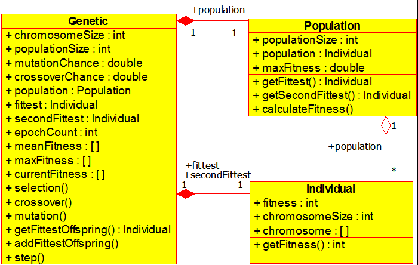

# Genetic algorithm
This is an implementation of genetic algo with **JavaScript**.

It can be used with a **Node.js** or in browser as you can see in `index.html`.

# Usage

1. Import main class of algorithm
2. Instantiate the class with parameters
3. Run a loop with desired conditions, progressing the algo with `step()` method.

Example:
```javascript
import Genetic from './implementations/new.js';

const algo = new Genetic(populationSize, chromosomeSize, mutationChance, crossoverChance, targetX, targetY);
while (algo.epochCount < maxIterations) {
    algo.step();
    console.log("Generation:", algo.epochCount, "Fittest:" , algo.fittest);
}
```

Another example of usage can be found in `index.js` file.
To see the code in action just open `index.html` in the browser.
There are three implementations of the algorithm. I recommend using `new.js` because it is the one working properly for sure. Others are a bit questionable at the moment.

# Screenshots
Parameters for the algorithm:


Work result:


# Docs

Class diagram:  

